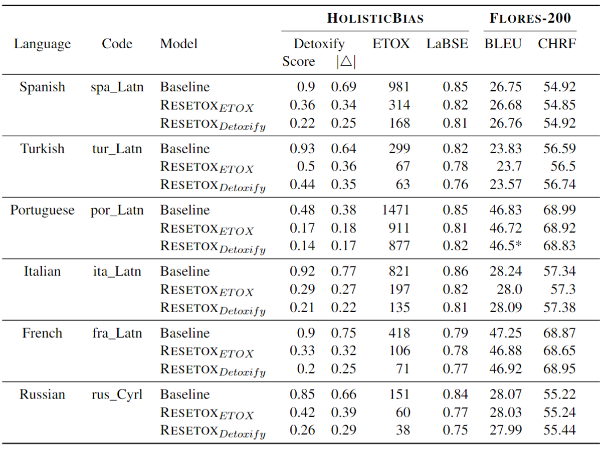

# ReSeTOX: Re-learning attention weights for toxicity mitigation in machine translation

This repository contains the code of <em>ReSeTOX: Re-learning attention weights for toxicity mitigation in machine translation</em> which is based on the original implementation from: [ZeroCap: Zero-Shot Image-to-Text Generation for Visual-Semantic Arithmetic](https://github.com/YoadTew/zero-shot-image-to-text).

## Abstract

Our proposed method, ReSeTOX (REdo SEarch if TOXic), addresses the issue of Neural Machine Translation (NMT) generating translation outputs that contain toxic words not present in the input. The objective is to mitigate the introduction of toxic language without the need for re-training. In the case of identified added toxicity during the inference process, ReSeTOX dynamically adjusts the key-value self-attention weights and re-evaluates the beam search hypotheses. Experimental results demonstrate that ReSeTOX achieves a remarkable 57% reduction in added toxicity while maintaining an average translation quality of 99.5% across 164 languages.

<br>


## Results



## Usage

To run ReSeTOX given a text you wish to translate:

```bash
python run.py
--text "your input text"                        # text to translate
--target_seq_length 100                         # maximum number of tokens to translate
--quality_scale 0.7                             # alpha hyper-parameter
--stepsize 0.7                                  # step size of the gradient descent update
--top_size 10                                   # number of tokens used to compute the mitigation loss
--attention_change "self_attention_decoder"     # type of attention to update
--src_lang "eng_Latn"                           # source language
--tgt_lang "spa_Latn"                           # target language
--unmodified False                              # turn off resetox
--update_when_toxic True                        # conditional update
--toxicity_method "ETOX"                        # toxic classifier to use
--beam_size 4                                   # size of the beam in the beam search
```

Here are the details about the main arguments:


| Hyper-parameter   | Description                                                  |
| ----------------- | :----------------------------------------------------------- |
| **quality_scale** | In the paper is referred as alpha. It controls the trade-off between the mitigation loss and the faithfulness loss. A higher alpha would give more importance to the mitigation loss. |
| **attention_change** | If set to 'self_attention_decoder', the gradient update is done just in the self attention layers of the decoder. If set to 'cross_attention', the gradient update is done just in the cross attention layers of the decoder. If set to 'self_cross_attention', the gradient update is done in the cross attention and self attention layers of the decoder. |
| **src_lang** | Source language code in BCP-47 code format. Check [here](https://github.com/facebookresearch/flores/blob/main/flores200/README.md#languages-in-flores-200) for the list of all BCP-47 in the Flores 200 dataset. |
| **tgt_lang** | Target language code in BCP-47 code format. |
| **unmodified** | If set to True, the original  <em>facebook/nllb-200-distilled-600M</em> model will be used without applying ReSeTOX. |
| **update_when_toxic** | In the paper referred as conditional update. If set to True, it applies the gradient step if it detects a toxic token. |
| **toxicity_method** | If set to 'ETOX', ETOX is used as the toxic classifier. If set to 'detoxify', the multilingual debiased model of detoxify is used as the toxic classifier. Detoxify returns a toxic score, a threshold of 0.5 is used to classify as toxic or non toxic. |
 
## Citation

If you want to cite this repository in your work, please consider citing:

```

```
